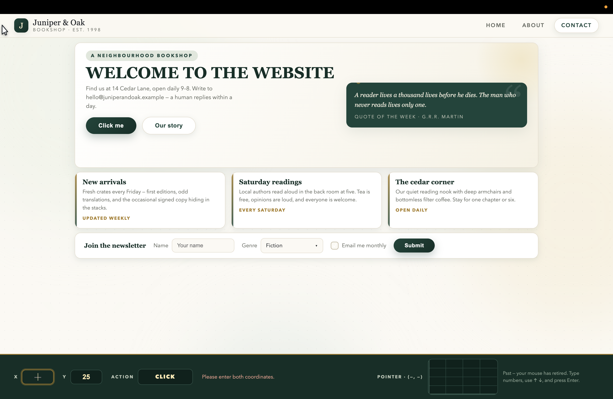
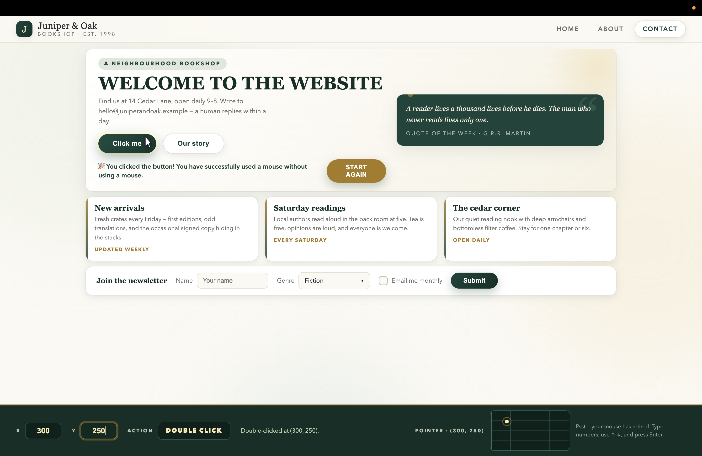

# COORDINATE_CURSOR 🎯

## Basic Details
### Team Name: Runtime error!!
### Team Members
- Team Lead: Gayos Paul - College Of Engineering Munnar
- Member 2: Gayos Paul - College Of Engineering Munnar
- Member 3: Adhinan P B - College Of Engineering Munnar

### Project Description
A normal-looking bookshop webpage ("Juniper & Oak") where the physical mouse and touchpad are completely useless. The real cursor is hidden, and the user controls a custom fake pointer using only X/Y coordinates, arrow keys, and Enter. The goal is to locate and interact with hidden webpage elements purely by experimenting with coordinates.

### The Problem (that doesn't exist)
Easy and effortless navigation through a webpage.

### The Solution (that nobody asked for)
Try using coordinates instead of the mouse or touch pad.

## Technical Details
### Technologies/Components Used
For Software:
- **Languages used:** HTML5, CSS3, JavaScript (ES6, Vanilla JS)
- **Frameworks used:** None (intentionally dependency-free, single `index.html`)
- **Libraries used:** None
- **Tools used:** VS Code, Git, GitHub, Google Chrome / any modern browser, `npx serve` for local preview

### Implementation
For Software:

# Installation
```bash
git clone <your-repo-url>
cd coordinate-cursor
```
No installation needed — zero dependencies. Optional local server:
```bash
npx serve .
```

# Run
**Option 1:** Double-click `index.html` to open it in a browser.
**Option 2:** Run `npx serve .` and open `http://localhost:3000`.

**How to use:**
1. The **X** field is autofocused on load — type a number.
2. Press **↓** to move to **Y**, type a number, press **↓** to reach **ACTION**.
3. Press **Enter** to cycle `CLICK` ↔ `DOUBLE CLICK` and fire at that coordinate.
4. The fake pointer glides there and genuinely clicks whatever element is at that point via `elementFromPoint`.

| Key | Inside X/Y | Elsewhere |
| --- | --- | --- |
| Number keys | ✅ allowed | ❌ ignored |
| Backspace | ✅ allowed | ❌ ignored |
| Arrow keys | ✅ allowed | ✅ allowed |
| Enter | ✅ cycle + fire | ✅ cycle + fire |
| Everything else (Tab, Space, letters…) | ❌ ignored | ❌ ignored |

Mouse movement, clicks, touchpad, scrolling, and Tab are all disabled.

### Project Documentation
For Software:

# Screenshots (Add at least 3)


# Diagrams

*Workflow: X/Y inputs → single state object → fake pointer glides → `elementFromPoint(x, y)` → real `click`/`dblclick` dispatched → UI updates (success message / nav / form). Keyboard arrows handle focus (X → Y → ACTION), Enter cycles the action and fires.*

For Hardware:
# Schematic & Circuit
Not applicable — software-only project, no circuit.

# Build Photos
Not applicable — software-only project, no hardware build.

### Project Demo
# Video
[Add your demo video link here]
*Demo shows: typing X/Y coordinates, navigating with ↓, pressing Enter to CLICK, the fake pointer gliding to the "Click me" button, the success message appearing, then locating START AGAIN through coordinates.*

# Additional Demos
[Add any extra demo materials/links]

## Team Contributions
- **Gayos Paul (Lead):** Core concept, fake-pointer engine, coordinate state management, click/double-click dispatch logic.
- **Gayos Paul (Member 2):** Keyboard control scheme (arrows/Enter/Backspace handling), mouse & touchpad suppression, error handling.
- **Adhinan P B:** UI styling and polish (bookshop theme, animations, controller bar, coordinate graph), testing, documentation.

---
Made with ❤️ at TinkerHub Useless Projects


